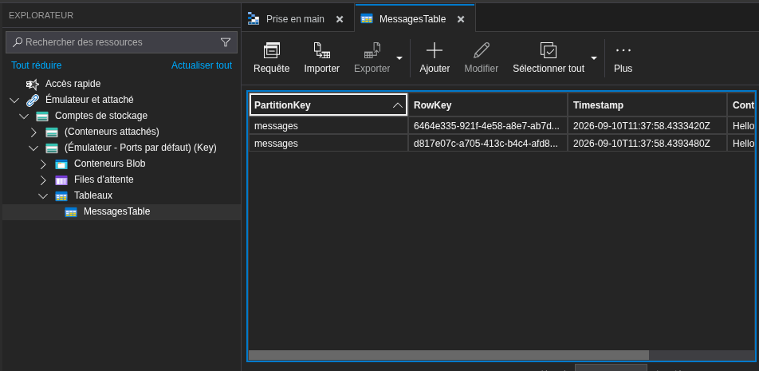

# TP1 – Azure Functions Serverless (local)

Architecture serverless événementielle simple, développée et exécutée **exclusivement en local** avec Azure Functions Core Tools et l'émulateur **Azurite**. Aucun compte Azure n'est requis.

## Architecture

```
curl (HTTP POST) ──► HttpTrigger ──publie un message──► Queue "outqueue"
                                                              │
                                                              ▼
                                                       QueueToTable
                                                              │
                                                écrit une ligne──► Table "MessagesTable"
```

Deux fonctions indépendantes, communiquant uniquement via des bindings Azure (aucun appel direct entre elles) :

| Fonction       | Déclencheur                | Rôle                                                                                                                                                                                    |
| -------------- | -------------------------- | --------------------------------------------------------------------------------------------------------------------------------------------------------------------------------------- |
| `HttpTrigger`  | HTTP (`POST`)              | Reçoit une requête HTTP, extrait le corps du message, le publie dans la queue de stockage `outqueue`. Fonction stateless, sans logique métier.                                          |
| `QueueToTable` | Queue Storage (`outqueue`) | Se déclenche automatiquement à l'arrivée d'un message dans `outqueue`, lit son contenu et écrit une nouvelle ligne dans la table `MessagesTable` (`PartitionKey`, `RowKey`, `Content`). |

## Prérequis

- [Node.js](https://nodejs.org/) (v18+)
- [Azure Functions Core Tools v4](https://learn.microsoft.com/en-us/azure/azure-functions/functions-run-local)
  ```bash
  npm install -g azure-functions-core-tools@4
  ```
- [Azurite](https://learn.microsoft.com/fr-fr/azure/storage/common/storage-use-azurite)
  ```bash
  npm install -g azurite
  ```
- [Azure Storage Explorer](https://azure.microsoft.com/products/storage/storage-explorer/) pour inspecter les données

## Lancer le projet en local

### 1. Démarrer Azurite

Dans un premier terminal, à la racine du projet :

```bash
azurite --location ./azurite-data --debug ./azurite-data/debug.log
```

Attendre que les 3 services soient à l'écoute :

```
Azurite Blob service is starting at http://127.0.0.1:10000
Azurite Blob service is successfully listening at http://127.0.0.1:10000
Azurite Queue service is starting at http://127.0.0.1:10001
Azurite Queue service is successfully listening at http://127.0.0.1:10001
Azurite Table service is starting at http://127.0.0.1:10002
Azurite Table service is successfully listening at http://127.0.0.1:10002
```

### 2. Installer les dépendances du projet

Dans un second terminal :

```bash
npm install
```

`local.settings.json` est déjà présent dans le dépôt avec `"AzureWebJobsStorage": "UseDevelopmentStorage=true"`, qui fait pointer les bindings de stockage vers Azurite plutôt que vers un vrai compte Azure.

### 3. Démarrer le runtime Azure Functions

```bash
func start
```

Les deux fonctions doivent apparaître :

```
Functions:
        HttpTrigger: [POST] http://localhost:7071/api/HttpTrigger
        QueueToTable: queueTrigger
```

### 4. Tester l'enchaînement complet

Dans un troisième terminal :

```bash
curl -X POST http://localhost:7071/api/HttpTrigger -d "Hello there"
```

Réponse attendue : `Message published in queue.`

Dans les logs de `func start`, on doit voir l'enchaînement automatique — d'abord la fonction HTTP, puis la fonction Queue qui se déclenche toute seule juste après :

```
Executing 'Functions.HttpTrigger' (Reason='This function was programmatically called via the host APIs.', ...)
Message received: Hello there
Executed 'Functions.HttpTrigger' (Succeeded, ...)

Executing 'Functions.QueueToTable' (Reason='New queue message detected on 'outqueue'.', ...)
Message received from queue : Hello there
Executed 'Functions.QueueToTable' (Succeeded, ...)
```

### 5. Vérifier les données (optionnel)

Avec Azure Storage Explorer, ouvrir l'émulateur local (`Émulateur et attaché`) :

- **Queues → outqueue** : doit être vide après traitement (message consommé et supprimé automatiquement).
- **Tables → MessagesTable** : doit contenir une ligne par message envoyé, avec `PartitionKey = messages`, un `RowKey` unique, et le contenu du message dans `Content`.



## Structure du projet

```
TpAzureFunction/
├── host.json                    # Configuration globale du host Functions
├── local.settings.json          # Config locale (chaîne de connexion Azurite)
├── package.json
└── src/
    └── functions/
        ├── HttpTrigger.js       # Fonction HTTP Trigger → Queue
        └── QueueToTable.js      # Fonction Queue Trigger → Table
```

## Notes

- Ce TP illustre le fonctionnement du **serverless événementiel** (déclencheurs et bindings), pas la construction d'une application complète — la simplicité de l'architecture est volontaire.
- `queueName` et `connection` doivent être identiques dans les deux fonctions (`outqueue` / `AzureWebJobsStorage`) pour que la chaîne fonctionne.
